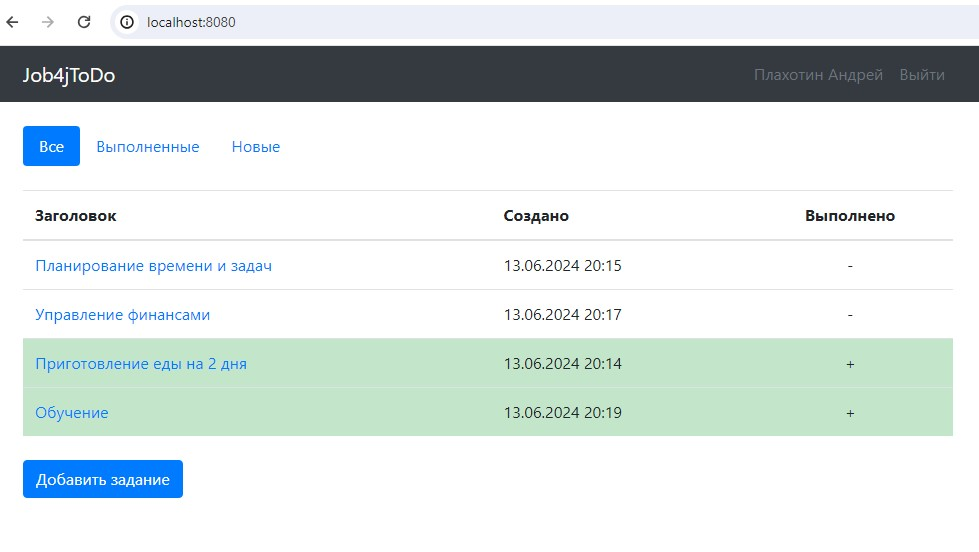
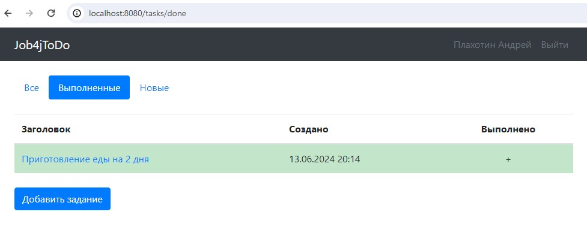
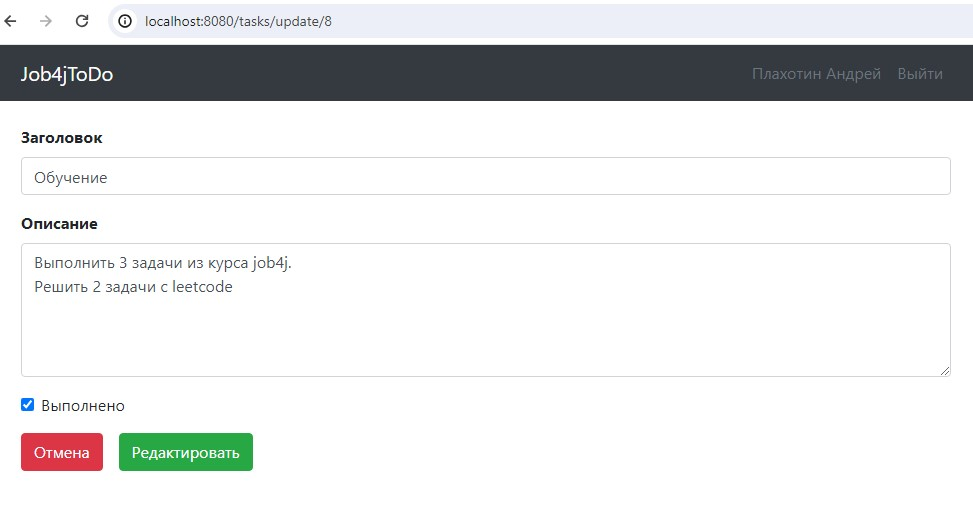

# Сервис - TODO список.

## О проекте
Приложение "TODO список" с возможностью чтения, фильтрации и редактирования заданий.

***

## Технологии
Spring (в частности Spring MVC и Spring Boot), Thymeleaf, Bootstrap, Liquibase, Hibernate, PostgreSQL

***

## Требования к окружению

Java 17, Maven 3.8, PostgreSQL 14, браузер.

***

## Запуск проекта

1. Создать базу данных todo при помощи консоли PostgreSQL или терминала pgAdmin: <br>
   ```create database todo```
2. Клонировать проект: <br>
   ```git clone git@github.com:plahotinandrei/job4j_todo.git```
3. Перейти в корень проекта и при помощи Maven собрать проект: <br>
   ```mvn install```
4. После успешной сборки проекта перейти в каталог target и запустить приложение: <br>
   ```cd target``` <br>
   ```java -jar job4j_todo-1.0-SNAPSHOT.jar```
5. В браузере открыть ссылку http://localhost:8080
***

## Взаимодействие с приложением
1. Главная страница. Список заданий и возможность отфильтровать и добавить новое задание.



2. Страница с отфильтрованным списком заданий.



3. Страница с формой для создания нового задания. При нажатии на кнопку "Отмена" происходит переход на главную страницу.


4. Страница с подробным описанием задания. При нажатии на кнопку "Выполнено" задание переносится в список выполненных заданий. При нажатии на кнопку "Редактировать" происходит переход на страницу с формой для редактирования задания. При нажатии на кнопку "Удалить" происходит удаление задания из списка.


5. Страница с подробным описанием задания. Задание выполнено. Кнопка "Выполнено" не активна.


6. Страница обновления задания. При нажатии на кнопку "Отмена" происходит возврат на страницу с подробным описанием этого задания.



7. Страница регистрации.


8. Страница входа.


***

### Контакты

> email: [plahotin94@yandex.ru](mailto:plahotin94@yandex.ru) <br>
> tg: [AndreyPlakhotin](https://t.me/AndreyPlakhotin) <br>